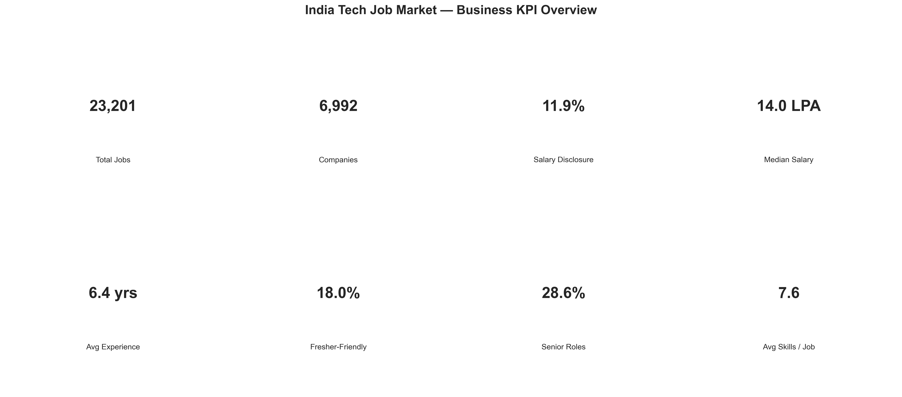
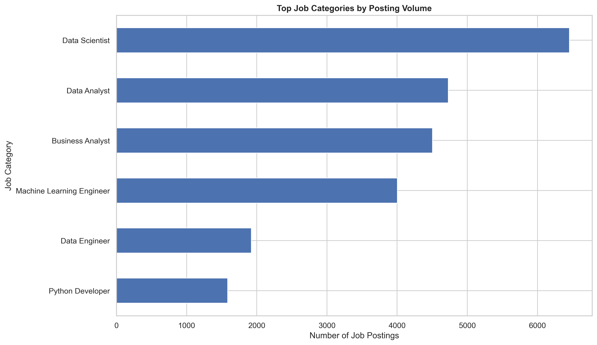
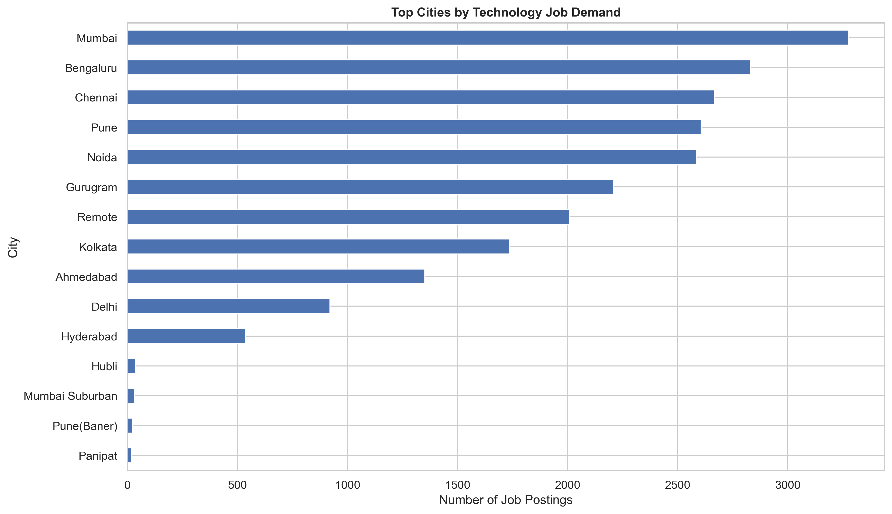
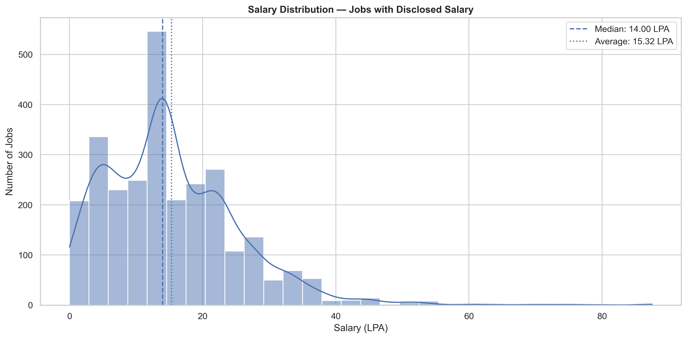
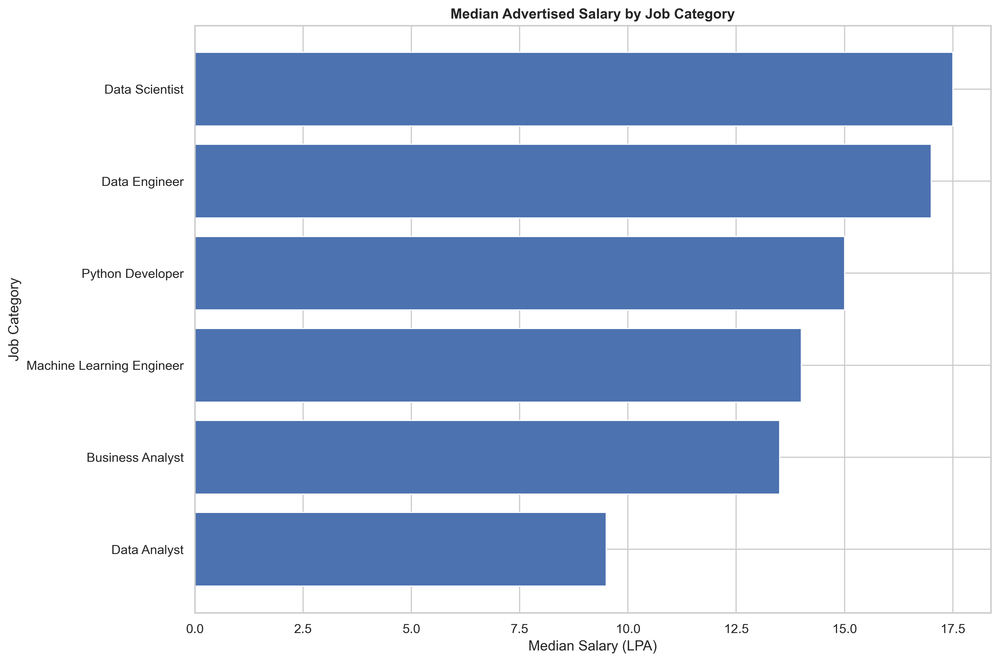
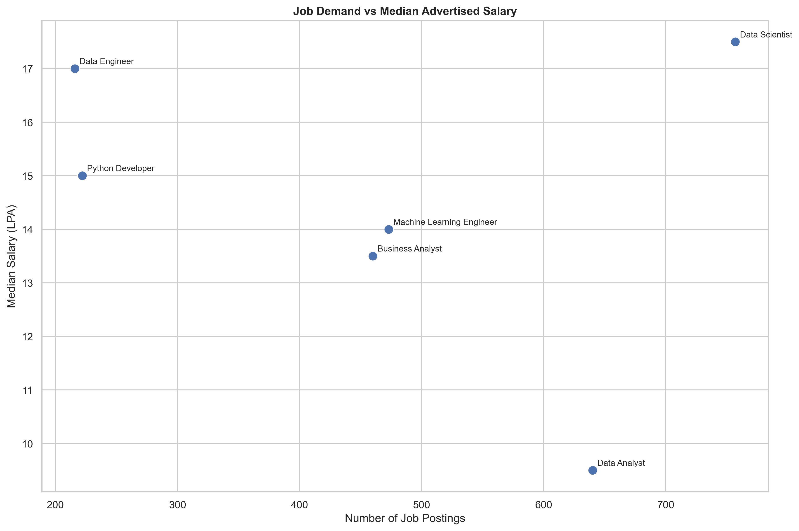
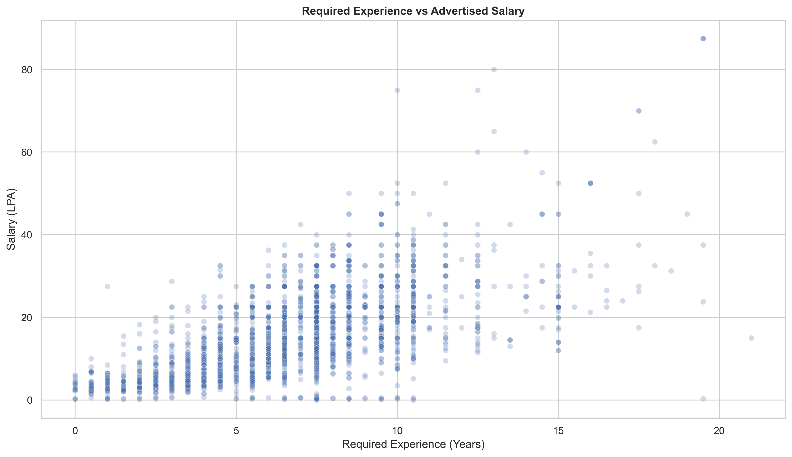
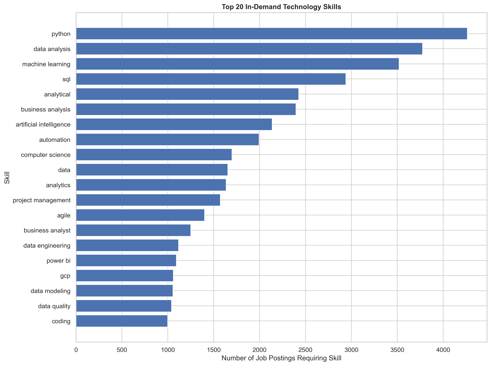
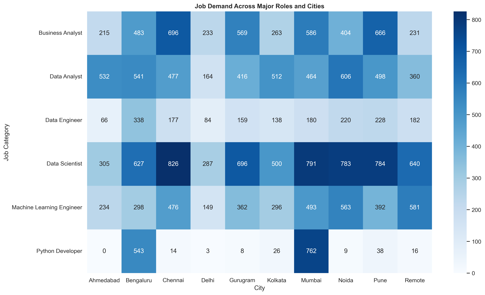
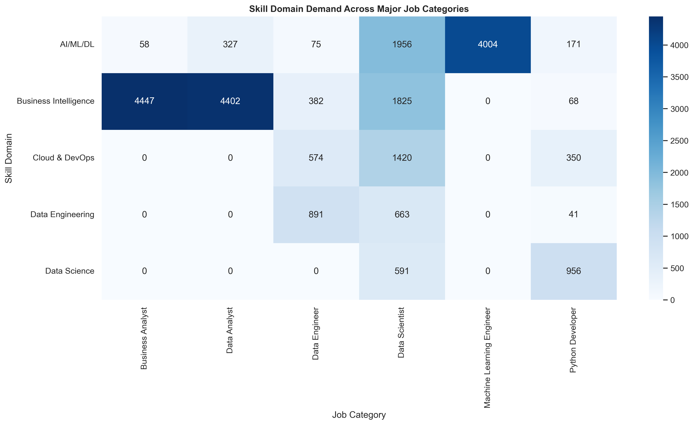

# 📊 Job Market & Skills Demand Analytics

An end-to-end **Data Analytics project** that analyzes the Indian technology job market to identify hiring demand, in-demand skills, salary trends, experience requirements, fresher opportunities, work modes, company hiring patterns, and geographic trends.

The project uses **Python, Pandas, NumPy, Matplotlib, Seaborn, SQL, and Jupyter Notebook** to transform raw job-posting data into business-ready insights and visualizations.

---

## 📌 Project Overview

The Indian technology job market is constantly changing. Companies demand different technical skills, salaries vary across roles and cities, and opportunities differ based on experience level.

This project analyzes job-posting data to answer questions such as:

- Which technology roles have the highest hiring demand?
- Which cities have the most technology job opportunities?
- What are the most in-demand technical skills?
- Which roles offer higher salaries?
- How does salary change with experience?
- Which roles provide opportunities for freshers?
- What are the most common work modes?
- Which companies are hiring the most?
- How transparent are companies about salary?
- How does company size affect hiring?
- Which roles have both high demand and attractive salaries?

---

## 🎯 Business Objectives

The analysis focuses on the following business areas:

1. 📈 Market Size
2. 💼 Hiring Demand
3. 📍 Geographic Hiring
4. 🛠️ Skill Demand
5. 💰 Salary Analysis
6. 👨‍💻 Experience Analysis
7. 🎓 Fresher Opportunities
8. 🏠 Work Mode Analysis
9. 🏢 Company Hiring
10. 📊 Company Size
11. 💵 Salary Transparency
12. 📅 Job Posting Recency

---

## 🛠️ Technologies Used

| Technology | Purpose |
|---|---|
| Python | Data cleaning, analysis and visualization |
| Pandas | Data manipulation and analysis |
| NumPy | Numerical operations |
| Matplotlib | Data visualization |
| Seaborn | Statistical visualization |
| SQL | Business metrics and analytical queries |
| Jupyter Notebook | Analysis workflow |
| CSV | Dataset and analytical outputs |
| GitHub | Project version control and documentation |

---

## 📂 Project Structure

```text
Job-Market-Skills-Demand-Analytics/
│
├── 📁 data/
│   ├── indian_tech_jobs_2026.csv
│   ├── indian_tech_jobs_2026_cleaned.csv
│   └── job_market_skill_table.csv
│
├── 📁 python/
│   ├── job_market_analysis.ipynb
│   └── .ipynb_checkpoints/
│
├── 📁 SQL/
│   └── job_market_business_metrics.sql.sql
│
├── 📁 reports/
│   ├── job_market_cleaning_log.csv
│   ├── job_market_quality_before.csv
│   ├── job_market_quality_after.csv
│   └── job_market_skill_demand.csv
│
├── 📁 visualizations/
│   ├── 00_kpi_business_overview.png
│   ├── 01_job_demand_by_role.png
│   ├── 02_job_demand_by_city.png
│   ├── 03_salary_distribution.png
│   ├── 04_salary_by_role.png
│   ├── 05_demand_vs_salary.png
│   ├── 06_experience_vs_salary.png
│   ├── 07_salary_by_experience_tier.png
│   ├── 08_fresher_opportunity_share.png
│   ├── 09_fresher_opportunities_by_role.png
│   ├── 10_fresher_jobs_by_city.png
│   ├── 11_work_mode_distribution.png
│   ├── 12_work_mode_by_role.png
│   ├── 13_top_in_demand_skills.png
│   ├── 14_skill_domain_demand.png
│   ├── 15_skills_required_by_role.png
│   ├── 16_top_hiring_companies.png
│   ├── 17_company_rating_vs_job_postings.png
│   ├── 18_company_size_hiring.png
│   ├── 19_job_posting_recency.png
│   ├── 20_salary_disclosure_by_role.png
│   ├── 21_salary_by_city.png
│   ├── 22_role_city_heatmap.png
│   └── 23_skill_domain_role_heatmap.png
│
├── requirements.txt
└── README.md
```

---

# 🔄 Project Workflow

```text
                Raw Job Market Data
                         │
                         ▼
                 Data Profiling
                         │
                         ▼
                  Data Cleaning
                         │
                         ▼
                Data Validation
                         │
                         ▼
               Feature Engineering
                         │
                         ▼
                  Skill Extraction
                         │
                         ▼
            Exploratory Data Analysis
                         │
                         ▼
              Business KPI Analysis
                         │
                         ▼
                   SQL Analysis
                         │
                         ▼
                 Data Visualization
                         │
                         ▼
                Business Insights
```

---

# 📊 Dataset

The project uses an Indian technology job-market dataset at the **job-posting level**.

### 1. Raw Dataset

`indian_tech_jobs_2026.csv`

Contains the original job-posting records.

### 2. Cleaned Dataset

`indian_tech_jobs_2026_cleaned.csv`

Contains cleaned and analysis-ready job records.

### 3. Skill Dataset

`job_market_skill_table.csv`

Contains individual skills extracted from job postings.

Columns include:

```text
job_id
skills_required_clean
skill
```

This allows analysis of how frequently individual skills appear across job postings.

---

# 📏 Dataset Scale

The cleaned dataset contains approximately:

- **23,201 job postings**
- **50 columns**

The skill-level dataset contains approximately:

- **176,394 skill records**
- **3 columns**

---

# 🧹 Data Cleaning & Preparation

The project includes several data-quality and preprocessing steps:

### Data Cleaning

- Removed duplicate records
- Handled placeholder values
- Cleaned text fields
- Validated job IDs
- Validated experience values
- Validated salary ranges
- Handled missing values
- Standardized analytical fields

### Feature Engineering

The project creates analytical features such as:

- Salary midpoint
- Experience midpoint
- Experience tier
- Fresher-friendly indicator
- Senior-role indicator
- Cleaned city
- Cleaned work mode
- Cleaned skill count
- Skill domain
- Salary disclosure indicator
- Company size bucket

---

# 📈 Key Performance Indicators

The analysis calculates business KPIs including:

| KPI | Description |
|---|---|
| Total Job Postings | Total number of jobs analyzed |
| Unique Companies | Number of companies hiring |
| Unique Cities | Number of hiring locations |
| Unique Job Categories | Number of job categories |
| Salary Disclosure Rate | Percentage of jobs with salary information |
| Median Salary | Median advertised salary |
| Average Salary | Average advertised salary |
| Fresher-Friendly Rate | Percentage of jobs suitable for freshers |
| Senior Job Rate | Percentage of senior-level jobs |
| Average Skills per Job | Average number of required skills |
| Average Company Rating | Average company rating |

---

# 📊 Data Analysis & Visualizations

The project generates **24 analytical visualizations** covering different aspects of the job market.

### Hiring Demand

- Job demand by role
- Job demand by city
- Top hiring companies
- Hiring by company size

### Salary Analysis

- Salary distribution
- Salary by role
- Salary by experience
- Salary by experience tier
- Salary by city
- Salary disclosure by role

### Fresher Analysis

- Fresher opportunity share
- Fresher opportunities by role
- Fresher opportunities by city

### Skills Analysis

- Top in-demand skills
- Skill domain demand
- Skills required by role
- Skill domain × role heatmap

### Geographic Analysis

- Job demand by city
- Role × city heatmap
- Salary by city

### Company Analysis

- Top hiring companies
- Company rating vs job postings
- Hiring by company size

### Other Analysis

- Work mode distribution
- Work mode by role
- Job posting recency
- Demand vs salary

---

# 🗄️ SQL Analysis

SQL is used to generate business-oriented metrics from the cleaned job-market data.

Examples include:

```sql
-- Total Job Postings
SELECT COUNT(*) AS total_job_postings
FROM job_market_cleaned;
```

```sql
-- Job Demand by Role
SELECT
    role_category,
    COUNT(*) AS job_postings
FROM job_market_cleaned
GROUP BY role_category
ORDER BY job_postings DESC;
```

```sql
-- Top In-Demand Skills
SELECT
    skill,
    COUNT(DISTINCT job_id) AS jobs_requiring_skill
FROM job_market_skill_table
GROUP BY skill
ORDER BY jobs_requiring_skill DESC
LIMIT 20;
```

SQL analysis covers:

- Market size
- Role demand
- City demand
- Top hiring companies
- Skill demand
- Salary by role
- Experience vs salary
- Fresher opportunities
- Work mode
- Salary transparency
- Company size
- High-demand and high-salary roles

---

# 📓 Python Analysis

The main analysis is available in:

```text
python/job_market_analysis.ipynb
```

The notebook performs:

1. Dataset loading
2. Data profiling
3. Data cleaning
4. Data validation
5. Feature engineering
6. Salary analysis
7. Experience analysis
8. Fresher analysis
9. Work-mode analysis
10. Skill analysis
11. Company analysis
12. Geographic analysis
13. KPI calculation
14. Visualization
15. Business metrics generation

---

# 📁 Reports Generated

The `reports/` folder contains supporting analytical outputs:

```text
job_market_cleaning_log.csv
job_market_quality_before.csv
job_market_quality_after.csv
job_market_skill_demand.csv
```

These files help document the data-cleaning process, data quality, and skill-demand analysis.

---

# 🖼️ Visualization Gallery

### KPI Overview



### Job Demand by Role



### Job Demand by City



### Salary Distribution



### Salary by Role



### Demand vs Salary



### Experience vs Salary



### Top In-Demand Skills



### Role × City Heatmap



### Skill Domain × Role Heatmap



---

# 💡 Business Questions Answered

This project answers practical questions such as:

### Hiring

- What are the most demanded technology roles?
- Which cities have the highest job demand?
- Which companies are hiring the most?

### Skills

- Which technical skills are most frequently requested?
- Which job categories require the most skills?
- Which skill domains are most important?

### Salary

- What is the salary distribution?
- Which roles have the highest salaries?
- Does salary increase with experience?
- Which cities offer higher advertised salaries?

### Career Opportunities

- What percentage of jobs are fresher-friendly?
- Which roles have the most fresher opportunities?
- Which cities have more fresher opportunities?

### Work Environment

- What percentage of jobs are remote, hybrid, or on-site?
- Which roles have greater remote/hybrid opportunities?

---

# 🔍 Example Business Insights

The analysis can be used to identify:

- High-demand technology roles
- High-demand technical skills
- Salary differences between roles
- Salary differences between cities
- Experience-related salary patterns
- Fresher-friendly job categories
- Major technology hiring locations
- Companies with high hiring volumes
- Differences in hiring across company sizes
- Roles combining strong hiring demand with attractive salary levels

> **Note:** Exact numerical findings should be taken from the generated datasets and visualizations because the project is designed to keep the analytical outputs reproducible.

---

# 🚀 How to Run the Project

## Step 1: Clone the Repository

```bash
git clone https://github.com/your-username/job-market-skills-demand-analytics.git
```

## Step 2: Open the Project

```bash
cd job-market-skills-demand-analytics
```

## Step 3: Create a Virtual Environment

```bash
python -m venv venv
```

### Windows

```bash
venv\Scripts\activate
```

### macOS/Linux

```bash
source venv/bin/activate
```

## Step 4: Install Dependencies

```bash
pip install -r requirements.txt
```

## Step 5: Start Jupyter Notebook

```bash
jupyter notebook
```

Open:

```text
python/job_market_analysis.ipynb
```

---

# 📦 Requirements

The project requires:

```text
pandas
numpy
matplotlib
seaborn
jupyter
```

Install them using:

```bash
pip install -r requirements.txt
```

---

# 🗃️ SQL Setup

The SQL analysis is available at:

```text
SQL/job_market_business_metrics.sql.sql
```

The queries assume the cleaned data has been loaded into a database containing:

```text
job_market_cleaned
job_market_skill_table
```

You can execute the queries using a MySQL-compatible SQL environment after loading the datasets into the corresponding tables.

---

# 📌 Project Highlights

### Data Analytics

✔ Data cleaning  
✔ Data validation  
✔ Exploratory Data Analysis  
✔ Feature engineering  
✔ KPI development  
✔ Business analysis  

### Python

✔ Pandas  
✔ NumPy  
✔ Matplotlib  
✔ Seaborn  
✔ Jupyter Notebook  

### SQL

✔ Aggregations  
✔ GROUP BY  
✔ Window functions  
✔ CTEs  
✔ Business KPIs  
✔ Salary analysis  
✔ Skill-demand analysis  

### Visualization

✔ Bar charts  
✔ Histograms  
✔ Scatter plots  
✔ Heatmaps  
✔ KPI dashboards  
✔ Comparative analysis  

---

# 🎓 Skills Demonstrated

This project demonstrates practical skills in:

- Data Cleaning
- Data Preprocessing
- Exploratory Data Analysis
- Data Visualization
- Statistical Analysis
- Feature Engineering
- SQL
- Business Intelligence
- KPI Analysis
- Data Storytelling
- Business Problem Solving

---

# 👩‍💻 Author

**Impana R**

B.Sc. Computer Science Student  
Aspiring Data Analyst

---

# ⭐ If You Find This Project Useful

If you find this project helpful, consider giving the repository a ⭐ on GitHub.

---

## 🔑 Focus Keywords

data analyst project, job market analysis, skills demand analysis, Indian tech job market, Python data analysis, SQL data analysis, salary analysis, job market analytics, fresher job opportunities, data visualization, Pandas, Matplotlib, Seaborn, Jupyter Notebook
